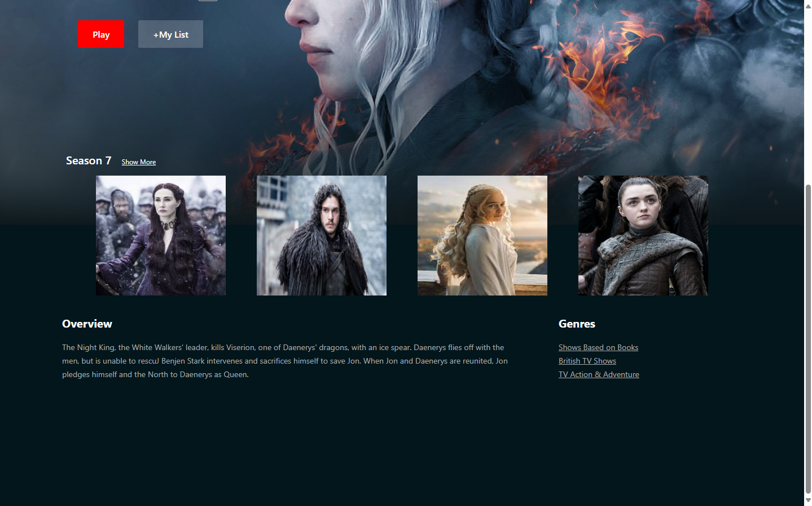

# HTML & CSS Project

Welcome to my HTML & CSS Project repository! This project showcases a modern, responsive web design crafted with HTML and CSS. Dive in to explore best practices in web development, and get inspired by clean, semantic code, and elegant styling.

## 🚀 Project Overview

This project is designed to be a comprehensive example for both beginners and seasoned developers. It includes:

- **Semantic HTML5**: Writing meaningful HTML that is accessible and easy to read.
- **Responsive Design**: Ensuring the site looks great on all devices using CSS3 media queries.
- **CSS Flexbox & Grid**: Demonstrating powerful layout techniques.
- **Customizable Themes**: Utilizing CSS variables for easy theming and customization.

## 📸 Screenshot

Here's a sneak peek of what the site looks like:




## 🌟 Features

- **Clean and Semantic HTML5 Code**: Well-structured and easy to understand.
- **Responsive Design**: Adapts beautifully to any screen size.
- **Customizable CSS Variables**: Quickly change the theme and styling.
- **Modern Layouts with Flexbox & Grid**: Examples of powerful CSS layout techniques.
- **Well-Documented Code**: Helpful comments and organization throughout the code.

## 🛠️ Getting Started

To get a local copy up and running, follow these simple steps:

1. **Clone the repository:**
   ```bash
   git clone https://github.com/yourusername/html-css-project.git
